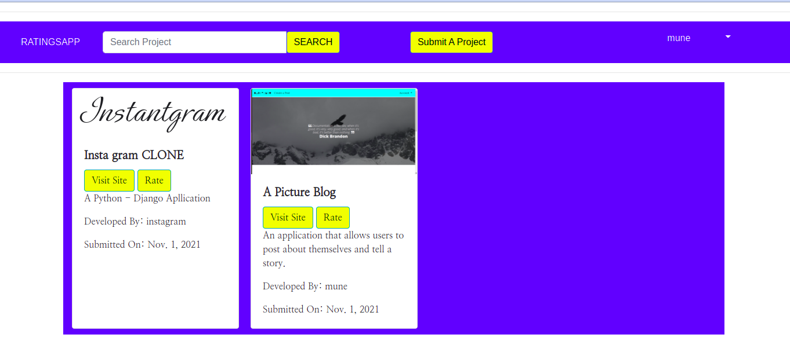

# INSTANTGRAM

## Description
An application that allows a USER to post a project link and have it reviewed by other USERS.


### USERS PROFILE



### HOME PAGE


### PROJECTS 

# User Stories


## As a user of the application I should be able to:

* View posted projects and their details
* Post a project to be rated/reviewed
* Rate/ review other users' projects
* Search for projects 
* View projects overall score
* View my profile page
## User environment

Application should be accessible to users on both desktop and mobile formats. The application is responsive to different screen sizes.

# Setup / Installation Requirements

## (A) Technologies Used
- Python 3.8
- Django 3.2
- Postgres Database
- UI-BOOTSTRAP
- Heroku

### (B) Step By Step Process

1. Copy repolink
2. Run `git clone REPO-URL` in your terminal
3. Write `cd instaratings`
4. Create a virtual environment with `virtualenv virtual` or try `python3 -m venv virtual`
5. Create .env file `touch .env` and add the following:
```
SECRET_KEY=<your secret key>
DEBUG=True
```
6. Enter your virtual environment `source virtual/bin/activate`
7. Run `pip install -r requirements.txt` or `pip3 install -r requirements.txt`
8. Create Postgres Database

```
psql
CREATE DATABASE instaratings
```
9. Check the database informatioin in `/settings.py`
```
DATABASES = {
    'default': {
        'ENGINE': 'django.db.backends.postgresql',
        'NAME': 'instaratings',
        'USER': *POSTGRES_USERNAME*,
        'PASSWORD': *POSTGRES_PASSWORD*,
    }
}
```
10. Run `./manage.py runserver` or `python3.8 manage.py runserver` to run the application

## Support and Contacts
* EMAIL:
 * maxwellmuthomijr@gmail.com

## LICENSE

{MIT License

Copyright (c) 2021

Permission is hereby granted, free of charge, to any person obtaining a copy of this software and associated documentation files (the "Software"), to deal in the Software without restriction, including without limitation the rights to use, copy, modify, merge, publish, distribute, sublicense, and/or sell copies of the Software, and to permit persons to whom the Software is furnished to do so, subject to the following conditions:

The above copyright notice and this permission notice shall be included in all copies or substantial portions of the Software.

THE SOFTWARE IS PROVIDED "AS IS", WITHOUT WARRANTY OF ANY KIND, EXPRESS OR IMPLIED, INCLUDING BUT NOT LIMITED TO THE WARRANTIES OF MERCHANTABILITY, FITNESS FOR A PARTICULAR PURPOSE AND NONINFRINGEMENT. IN NO EVENT SHALL THE AUTHORS OR COPYRIGHT HOLDERS BE LIABLE FOR ANY CLAIM, DAMAGES OR OTHER LIABILITY, WHETHER IN AN ACTION OF CONTRACT, TORT OR OTHERWISE, ARISING FROM, OUT OF OR IN CONNECTION WITH THE SOFTWARE OR THE USE OR OTHER DEALINGS IN THE SOFTWARE. } Copyright (c) {2021} 
{ Maxwell Munene}
